[](https://python.org)
[](https://djangoproject.com)
[](https://www.django-rest-framework.org/)
[](https://www.django-rest-framework.org/)

[](https://www.psycopg.org/)
[](https://www.postgresql.org/)
[](https://www.pgadmin.org/)
[](https://www.docker.com/)
[](https://docs.docker.com/compose/)

#Python authentication API for TrailerPlan
## 1. Summary
This project is a connection rest API designed with the django rest framework. It can be used with an front end designed with Angular, the repository is https://github.com/boonsuli/trailerplan-login-ng. 

In this backend project the features are : 
- login (signin)
- the username for the login feature can be : mail, some number like company identifier, username, msisdn (iso phone number)
- register a new user with profile user (signup)
- an API for the forgotten password in order to obtain this one when the user does not remember it anymore. When the user subscribes using a reactive form, he must give 3 answers for 3 secret questions. This is in order to obtain the password when it no longer remembers it.
  There is also a custom question and answer that he needs to fill.
- change password api
- the password must respect a format. You need: a lowercase letter, an uppercase letter, a number and a non-alphanumeric character.
- the data transfer for the password with the front end is in base 64 encoded
- the password stored in postgres with the standard django procedure. In this project the hasher algorithm is PBKDF2.  
- when the user authenticated a json web token generated
- the api can be test with : the front end Angular (https://github.com/boonsuli/trailerplan-login-ng),
  swagger ui, django rest admin and curl
- python application and postgresql database containerized in docker images

The application developed on Linux Mint 20.04 (Ulyana)

## 2. To run the docker images for the database (postgres) and client db (pgadmin)
### 2.1. database postgres
To run the database on docker using docker-compose :
```shell
~/trailerplan_auth_py$: docker-compose --env-file ./docker/config/env.dev --log-level debug up -d --build postgres &
```

in another terminal :

```shell
~/trailerplan_auth_py$: docker ps
CONTAINER ID   IMAGE                  COMMAND                  CREATED          STATUS          PORTS                                       NAMES
5632db03a4d3   postgres:12.5-alpine   "docker-entrypoint.s…"   18 seconds ago   Up 17 seconds   0.0.0.0:5432->5432/tcp, :::5432->5432/tcp   postgres-container
```

```shell
~/trailerplan_auth_py$: docker logs postgres-container
 PostgreSQL Database directory appears to contain a database; Skipping initialization
 
 2021-09-02 14:28:59.091 UTC [1] LOG:  starting PostgreSQL 12.5 on x86_64-pc-linux-musl, compiled by gcc (Alpine 10.2.1_pre1) 10.2.1 20201203, 64-bit
 2021-09-02 14:28:59.092 UTC [1] LOG:  listening on IPv4 address "0.0.0.0", port 5432
 2021-09-02 14:28:59.092 UTC [1] LOG:  listening on IPv6 address "::", port 5432
 2021-09-02 14:28:59.095 UTC [1] LOG:  listening on Unix socket "/var/run/postgresql/.s.PGSQL.5432"
 2021-09-02 14:28:59.103 UTC [21] LOG:  database system was shut down at 2021-09-02 14:28:12 UTC
 2021-09-02 14:28:59.105 UTC [1] LOG:  database system is ready to accept connections
```

### 2.2. database client pgadmin
To run the database client on docker using docker-compose :
```shell
~/trailerplan_auth_py$: docker-compose --env-file ./docker/config/env.dev --log-level debug up -d --build pgadmin &
```

in another terminal :

```shell
~/trailerplan_auth_py$: docker ps
CONTAINER ID   IMAGE                  COMMAND                  CREATED          STATUS          PORTS                                       NAMES
6f0d53844638   dpage/pgadmin4:4.30    "/entrypoint.sh"         9 seconds ago    Up 8 seconds    443/tcp, 0.0.0.0:5050->80/tcp, :::5050->80/tcp   pgadmin-container
5632db03a4d3   postgres:12.5-alpine   "docker-entrypoint.s…"   18 minutes ago   Up 18 minutes   0.0.0.0:5432->5432/tcp, :::5432->5432/tcp        postgres-container
```

#### 2.2.1. connect to the database postgres
In a browser open the url: http://localhost:5050.
Log in with the credential : username:postgres@trailerplan.com and password:P@55w*rD
Add a new server in the database connection tree like this:
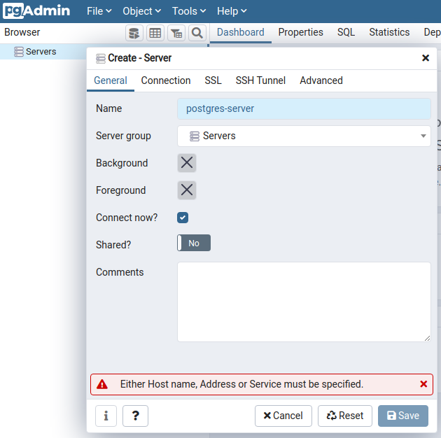
The two containers are in the same network, we can use the server name as postgres-server.
After that we need to fill some detail of the connection : 
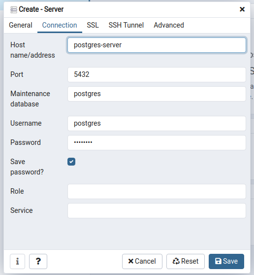. You can find the connection detail in the docker images configuration file (./docker/config/env.dev)

When the connection is created, the database and tables can be browsed.
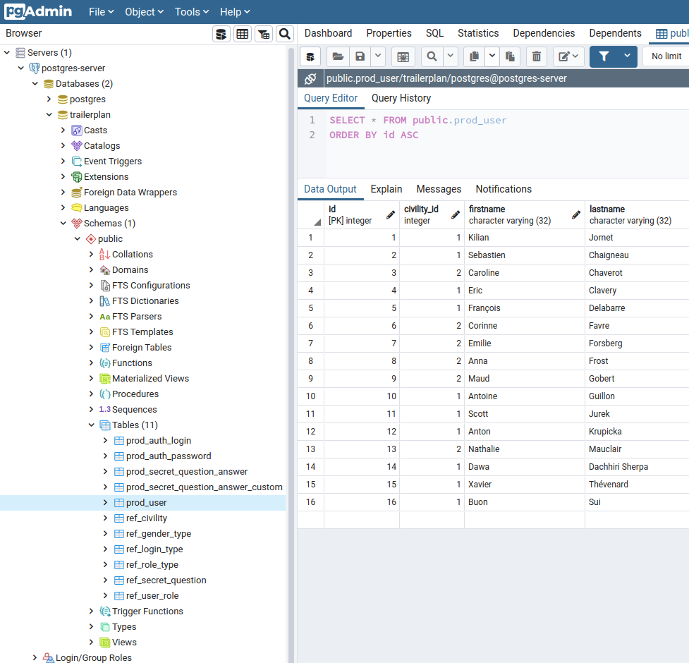

## 3. Configuring the django python application
## 3.1 Exporting the data model from the existing database
The current model is a data model exported from the postgres database.
The command to export the model was :
```shell
~/trailerplan_auth_py$: python3 manage.py inspectdb > app_python/models.py
```

Migration for the app : 
```shell
~/trailerplan_auth_py$: python3 manage.py makemigrations app_python
Migrations for 'app_python':
  app_python/migrations/0001_initial.py
    - Create model User
```

Running the migration :
```shell
~/trailerplan_auth_py$: python3 manage.py migrate
Operations to perform:
  Apply all migrations: admin, app_python, auth, contenttypes, sessions
Running migrations:
  Applying contenttypes.0001_initial... OK
  Applying auth.0001_initial... OK
  Applying admin.0001_initial... OK
  Applying admin.0002_logentry_remove_auto_add... OK
  Applying admin.0003_logentry_add_action_flag_choices... OK
  Applying app_python.0001_initial... OK
  Applying contenttypes.0002_remove_content_type_name... OK
  Applying auth.0002_alter_permission_name_max_length... OK
  Applying auth.0003_alter_user_email_max_length... OK
  Applying auth.0004_alter_user_username_opts... OK
  Applying auth.0005_alter_user_last_login_null... OK
  Applying auth.0006_require_contenttypes_0002... OK
  Applying auth.0007_alter_validators_add_error_messages... OK
  Applying auth.0008_alter_user_username_max_length... OK
  Applying auth.0009_alter_user_last_name_max_length... OK
  Applying auth.0010_alter_group_name_max_length... OK
  Applying auth.0011_update_proxy_permissions... OK
  Applying auth.0012_alter_user_first_name_max_length... OK
  Applying sessions.0001_initial... OK
```

Creation of the super user :
```shell
~/trailerplan_auth_py$: python3 manage.py createsuperuser
Username : admin
Email address: admin@trailerplan.com
Password: <enter your password>
Password (again): <enter your password>
Superuser created successfully
```

Verify that the user was created in the database : 
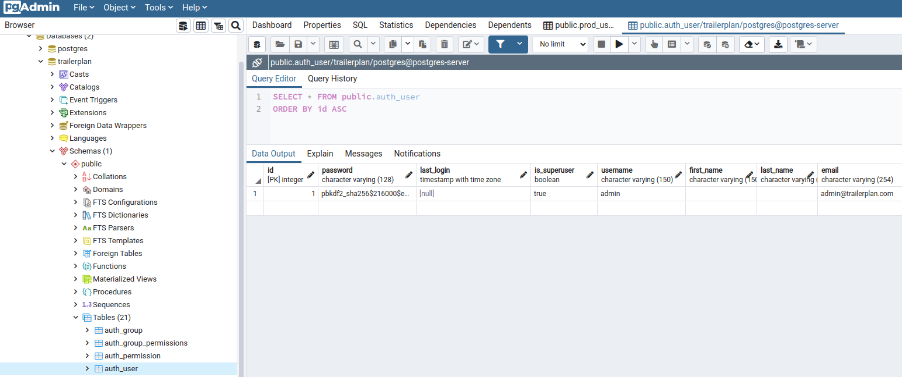

In this part we use the django standard authentication table : ```auth_user```. In the chapter, 6, we will use a custom user table. Sometimes in a project we already have a user table, and we would like to use it.   

## 3.2 Update the setting regarding the logs:
Logging settings for the module trailerplan login module ```~/trailerplan_auth_py/settings.py``` :
```shell
LOGGING = {
    'version': 1,
    'disable_existing_loggers': False,
    'formatters': {
        'verbose': {
            'format': '{levelname} {asctime} {module} {message}',
            'style': '{',
        },
        'simple': {
            'format': '{levelname} {message}',
            'style': '{',
        },
    },
    'handlers': {
        'console': {
            'class': 'logging.StreamHandler',
            'level': 'INFO',
            'formatter': 'verbose'
        },
    },
    'loggers': {
        'django': {
            'handlers': ['console'],
            'level': os.getenv('DJANGO_LOG_LEVEL', 'INFO'),
        },
        'app_python': {
            'handlers': ['console'],
            'level': 'INFO',
        }
    },
}
```

example of logs : 
```shell
INFO 2021-09-06 16:10:55,424 basehttp "GET /users/1 HTTP/1.1" 301 0
INFO 2021-09-06 16:10:55,520 views get user with id=1
INFO 2021-09-06 16:10:55,525 basehttp "GET /users/1/ HTTP/1.1" 200 347
```

## 3.3
Update the application part : urls and view

### 3.3.1 urls
```~/app_python/urls.py``` :
```shell
from django.conf.urls import url

from app_python.views.user_view import UserView
from app_python.views.users_view import UsersView

urlpatterns = [
    url(r'^api/users$', UsersView.as_view(), name='user-list'),
    url(r'^api/users/(?P<user_id>[0-9]+)$', UserView.as_view(), name='user-detail'),
]
```

### 3.3.2 view
We separate each url in one view. In order to have an implementation of each http method per function.

This view ```~/app_python/views/user_view.py``` is related to the url 'user-detail' with the method http GET, PUT, DELETE.
This view ```~/app_python/views/users_view.py``` is related to the url 'user-list' with the method http GET, POST, DELETE.


## 3.4 Django admin
The django admin website can be accessed by the url : http://localhost:8000/admin


## 4. Running the application
After configuring the application and the database, we can run the app. I use the command prompt or PyCharm in 
debug mode.

### 4.1 in command prompt
```shell
~/trailerplan_auth_py$: python3 manage.py runserver
```

or launch the application in PyCharm : 
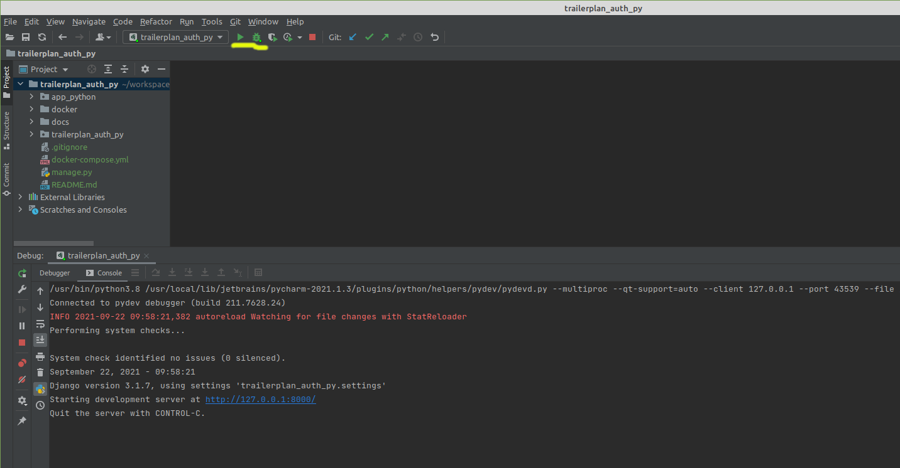


### 4.2 testing rest api
In another terminal, if the app is launch in a terminal ;-) :


- GET user by id :
```shell
~/trailerplan_auth_py$: curl http://localhost:8000/api/users/1
{"id": 1, "civility": "Mister", "first_name": "Kilian", "last_name": "Jornet", "gender": "MALE", "birthday": "1987-10-27", "mail": "kilian.jornet@gmail.com", "city": "Sabadell", "country": "Spain", "phone": null,
"user_category": "USER", "role_type": "STANDARD", "user_name": "kilian.jornet@gmail.com", "login_type": "MAIL", 
"encoded_password": "cGFzc3dvcmQxMjMK", "secret_question": "What is the city of your first job?", "encoded_secret_answer": "Q2hhbW9uaXgK", "encoded_custom_secret_question": "V2hhdCBpcyB5b3VyIGZhdm9yaXRlIHNwb3J0Pwo=", "encoded_custom_secret_answer": "VHJhaWwgcnVubmluZwo="}
```

in the application logs:
```shell
INFO 2021-09-22 09:28:39,979 user_view GET - get user by id=19
INFO 2021-09-22 09:28:39,985 basehttp "GET /api/users/19 HTTP/1.1" 200 676
```

- GET all user :
```shell
~/trailerplan_auth_py$: curl http://localhost:8000/api/users
[{"id": 1, "civility": "Mister", "first_name": "Kilian", "last_name": "Jornet", "gender": "MALE", "birthday": "1987-10-27", "mail": "kilian.jornet@gmail.com", "city": "Sabadell", "country": "Spain", "phone": null, "user_category": "USER", "role_type": "STANDARD", "user_name": "kilian.jornet@gmail.com", "login_type": "MAIL", "encoded_password": "cGFzc3dvcmQxMjMK", "secret_question": "What is the city of your first job?", "encoded_secret_answer": "Q2hhbW9uaXgK", "encoded_custom_secret_question": "V2hhdCBpcyB5b3VyIGZhdm9yaXRlIHNwb3J0Pwo=", "encoded_custom_secret_answer": "VHJhaWwgcnVubmluZwo="},
{"id": 2, "civility": "Mister", "first_name": "Sebastien", "last_name": "Chaigneau", "gender": "MALE", "birthday": "1972-02-23", "mail": "sebastien.chaigneau@gmail.com", "city": "Ch\u00e2tellerault", "country": "France", "phone": "+33612345678", "user_category": "USER", "role_type": "STANDARD", "user_name": "+33612345678", "login_type": "MSISDN", "encoded_password": "cGFzc3dvcmQxMjMK", "secret_question": "What is the city of your first job?", "encoded_secret_answer": "T3Nsbwo=", "encoded_custom_secret_question": "V2hhdCBpcyB5b3VyIGZhdm9yaXRlIHNwb3J0Pwo=", "encoded_custom_secret_answer": "VHJhaWwgcnVubmluZwo="},
{"id": 3, "civility": "Miss", "first_name": "Caroline", "last_name": "Chaverot", "gender": "FEMALE", "birthday": "1976-10-16", "mail": "caroline.chaverot@gmail.com", "city": "Gen\u00e8ve", "country": "Swiss", "phone": null, "user_category": "USER", "role_type": "STANDARD", "user_name": "123456", "login_type": "USER_NUMBER", "encoded_password": "cGFzc3dvcmQxMjMK", "secret_question": "What is the city of your first job?", "encoded_secret_answer": "QW1zdGVyZGFtCg==", "encoded_custom_secret_question": "V2hhdCBpcyB5b3VyIGZhdm9yaXRlIHNwb3J0Pwo=", "encoded_custom_secret_answer": "VHJhaWwgcnVubmluZwo="},
...
]
```

- POST a new user :
```shell
~/trailerplan_auth_py$: curl -X POST -H "Content-Type: application/json" -d  '{"civility": "Mister", "first_name": "FNameFake_create", "last_name": "LNameFake_create", "gender": "MALE", "birthday": "2021-09-01", "mail": "FNameFake_create.LNameFake_create@trailerplan.com", "city": "Paris", "country": "France", "phone": "1234567890", "user_category": "USER", "role_type": "STANDARD", "user_name": "FNameFake_create.LNameFake_create@trailerplan.com", "login_type": "MAIL", "encoded_password": "cGFzc3dvcmQxMjMK", "secret_question": "What is the city of your first job?", "encoded_secret_answer": "QmVybGluCg==", "encoded_custom_secret_question": "V2hhdCBpcyB5b3VyIGZhdm9yaXRlIHNwb3J0Pwo=", "encoded_custom_secret_answer": "VHJhaWwgcnVubmluZwo="}' http://localhost:8000/api/users
{"id": 19, "civility": "Mister", "first_name": "FNameFake_create", "last_name": "LNameFake_create", "gender": "MALE", "birthday": "2021-09-01", "mail": "FNameFake_create.LNameFake_create@trailerplan.com", "city": "Paris", "country": "France", "phone": "1234567890", "user_category": "USER", "role_type": "STANDARD", "user_name": "FNameFake_create.LNameFake_create@trailerplan.com", "login_type": "MAIL", "encoded_password": "cGFzc3dvcmQxMjMK", "secret_question": "What is the city of your first job?", "encoded_secret_answer": "QmVybGluCg==", "encoded_custom_secret_question": "V2hhdCBpcyB5b3VyIGZhdm9yaXRlIHNwb3J0Pwo=", "encoded_custom_secret_answer": "VHJhaWwgcnVubmluZwo="}
```

The user saved in postgres, a sql request in pgadmin :
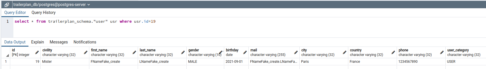

in the application logs :
```shell
INFO 2021-09-22 09:17:54,438 basehttp "POST /api/users HTTP/1.1" 201 676
```

- PUT (update) a user by id :
```shell
~/trailerplan_auth_py$: curl -X PUT -H "Content-Type: application/json" -d '{"id": 19, "civility": "Mister", "first_name": "FNameFake_update", "last_name": "LNameFake_update", "gender": "MALE", "birthday": "2021-09-01", "mail": "FNameFake_create.LNameFake_create@trailerplan.com", "city": "Paris", "country": "France", "phone": "1234567890", "user_category": "USER", "role_type": "STANDARD", "user_name": "FNameFake_create.LNameFake_create@trailerplan.com", "login_type": "MAIL", "encoded_password": "cGFzc3dvcmQxMjMK", "secret_question": "What is the city of your first job?", "encoded_secret_answer": "QmVybGluCg==", "encoded_custom_secret_question": "V2hhdCBpcyB5b3VyIGZhdm9yaXRlIHNwb3J0Pwo=", "encoded_custom_secret_answer": "VHJhaWwgcnVubmluZwo="}' http://localhost:8000/api/users/19
{"id": 19, "civility": "Mister", "first_name": "FNameFake_update", "last_name": "LNameFake_update", "gender": "MALE", "birthday": "2021-09-01", "mail": "FNameFake_create.LNameFake_create@trailerplan.com", "city": "Paris", "country": "France", "phone": "1234567890", "user_category": "USER", "role_type": "STANDARD", "user_name": "FNameFake_create.LNameFake_create@trailerplan.com", "login_type": "MAIL", "encoded_password": "cGFzc3dvcmQxMjMK", "secret_question": "What is the city of your first job?", "encoded_secret_answer": "QmVybGluCg==", "encoded_custom_secret_question": "V2hhdCBpcyB5b3VyIGZhdm9yaXRlIHNwb3J0Pwo=", "encoded_custom_secret_answer": "VHJhaWwgcnVubmluZwo="}
```

The user updated in postgres, a sql request in pgadmin :
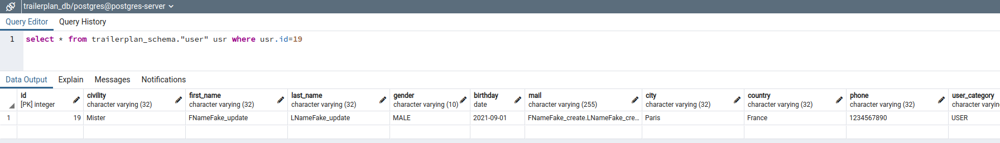

in the application logs:
```shell
INFO 2021-09-22 09:32:50,536 user_view PUT - update user by id=19
INFO 2021-09-22 09:32:50,541 user_view user to update:
INFO 2021-09-22 09:32:50,541 user_view {'id': 19, 'civility': 'Mister', 'first_name': 'FNameFake_update', 'last_name': 'LNameFake_update', 'gender': 'MALE', 'birthday': '2021-09-01', 'mail': 'FNameFake_create.LNameFake_create@trailerplan.com', 'city': 'Paris', 'country': 'France', 'phone': '1234567890', 'user_category': 'USER', 'role_type': 'STANDARD', 'user_name': 'FNameFake_create.LNameFake_create@trailerplan.com', 'login_type': 'MAIL', 'encoded_password': 'cGFzc3dvcmQxMjMK', 'secret_question': 'What is the city of your first job?', 'encoded_secret_answer': 'QmVybGluCg==', 'encoded_custom_secret_question': 'V2hhdCBpcyB5b3VyIGZhdm9yaXRlIHNwb3J0Pwo=', 'encoded_custom_secret_answer': 'VHJhaWwgcnVubmluZwo='}
INFO 2021-09-22 09:32:50,548 user_view user updated
INFO 2021-09-22 09:32:50,550 basehttp "PUT /api/users/19 HTTP/1.1" 200 676
```

- DELETE a user by id :
```shell
~/trailerplan_auth_py$: curl -X DELETE http://localhost:8000/api/users/19
```

The user deleted in postgres, a sql request in pgadmin :
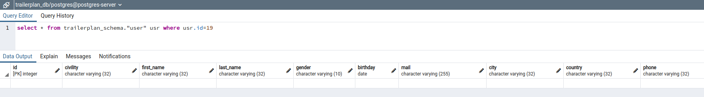

in the application logs :
```shell
INFO 2021-09-22 09:48:04,972 user_view DELETE - delete user by id=19
INFO 2021-09-22 09:48:04,978 basehttp "DELETE /api/users/19 HTTP/1.1" 204 27
```

## 5. Json Web Token settings - secure with django user tables auth_user
In this project, the library djangorestframework-jwt is using. There is a lot of libraries for the feature jwt in django restframework, like  
djangorestframework-simplejwt and 

## 5.1. App Settings
```shell
REST_FRAMEWORK = {
    'DEFAULT_PERMISSION_CLASSES': (
        'rest_framework.permissions.IsAdminUser',
    ),
    'DEFAULT_AUTHENTICATION_CLASSES': (
        'rest_framework_jwt.authentication.JSONWebTokenAuthentication',
    ),
...
}
```

## 5.2. Secure the view
The view can be secure with : 
```shell
class UserView(RetrieveAPIView):
==> permission_classes = (IsAuthenticated,)
==> authentication_classes = (JSONWebTokenAuthentication,)
    serializer_class = UserSerializer
```

## 5.3. Testing with postman
Check it with postman : 
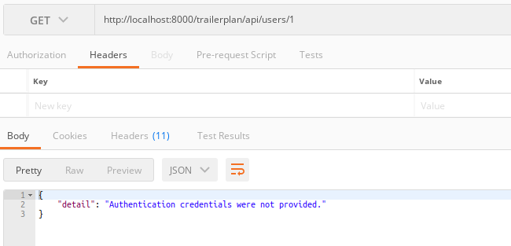
The user with id=1 can't be displayed, the jwt token not send in the request

Get the token :
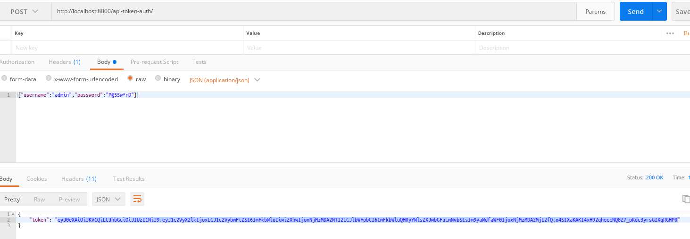
The user admin is the user created before. The data are in the table auth_user

Verify the token :
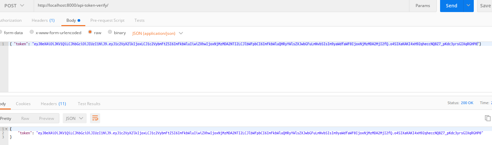

Get the user again with the token :
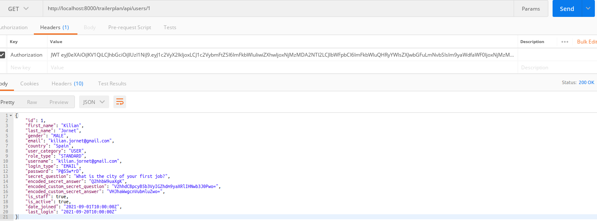
The token is in the attribute ```Authorisation``` and the value must be prefixed by ```JWT``` specified in the 
parameter ```JWT_AUTH_HEADER_PREFIX``` in the ```JWT_AUTH``` object in settings.


# 6. Json Web Token settings - secure with custom user tables
There are two ways in order to solve this feature :
- inherit the standard user model
- replace the exiting user model by another one

In this project, we choose the second solution. The user's passwords stored in the standard way. In the settings :

```shell
AUTH_USER_MODEL = 'app_python.User'
```

We can recreate the database : 
- stop the container :
```shell
~/trailerplan_auth_py$: docker stop postgres-container pgadmin-container
```

- remove the container in order to recreate them:
```shell
~/trailerplan_auth_py$: docker container rm postgres-container pgadmin-container
```

- remove the volume :
```shell
~/trailerplan_auth_py$: docker volume rm trailerplan_auth_py_pg-data trailerplan_auth_py_pgadmin-data
```

- remove the network :
```~/trailerplan_auth_py$: docker network rm trailerplan_auth_py_postgres-network```

- start the container builder for postgres :
```~/trailerplan_auth_py$: docker-compose --env-file ./docker/config/env.dev --log-level debug up -d --build postgres```

- display the logs of container starting :
```shell
~/trailerplan_auth_py$: docker logs postgres-container```
...
2021-10-06 12:01:53.594 UTC [1] LOG:  database system is ready to accept connections
...
```

- building the new container :
```shell
~/trailerplan_auth_py$: docker-compose --env-file ./docker/config/env.dev --log-level debug up -d --build pgadmin
```


make migrations:
```shell
~/trailerplan_auth_py$: python3 manage.py makemigrations
Migrations for 'app_python':
  app_python/migrations/0001_initial.py
    - Create model User
```

migrate :
```shell
~/trailerplan_auth_py$: python3 manage.py migrate
Operations to perform:
  Apply all migrations: admin, app_python, auth, authtoken, contenttypes, sessions
Running migrations:
  Applying contenttypes.0001_initial... OK
  Applying app_python.0001_initial... OK
  Applying admin.0001_initial... OK
  Applying admin.0002_logentry_remove_auto_add... OK
  Applying admin.0003_logentry_add_action_flag_choices... OK
  Applying contenttypes.0002_remove_content_type_name... OK
  Applying auth.0001_initial... OK
  Applying auth.0002_alter_permission_name_max_length... OK
  Applying auth.0003_alter_user_email_max_length... OK
  Applying auth.0004_alter_user_username_opts... OK
  Applying auth.0005_alter_user_last_login_null... OK
  Applying auth.0006_require_contenttypes_0002... OK
  Applying auth.0007_alter_validators_add_error_messages... OK
  Applying auth.0008_alter_user_username_max_length... OK
  Applying auth.0009_alter_user_last_name_max_length... OK
  Applying auth.0010_alter_group_name_max_length... OK
  Applying auth.0011_update_proxy_permissions... OK
  Applying auth.0012_alter_user_first_name_max_length... OK
  Applying authtoken.0001_initial... OK
  Applying authtoken.0002_auto_20160226_1747... OK
  Applying authtoken.0003_tokenproxy... OK
  Applying sessions.0001_initial... OK
```

Now in the database we don't have the django user table :


Resources : 
- https://docs.djangoproject.com/en/3.1/
- https://www.django-rest-framework.org/
- https://www.metaltoad.com/blog/angular-api-calls-django-authentication-jwt
- https://medium.com/swlh/django-angular-4-a-powerful-web-application-60b6fb39ef34
- https://www.bezkoder.com/django-angular-crud-rest-framework/
- https://www.bezkoder.com/django-angular-postgresql
- https://pypi.org/project/django-cors-headers/
- https://simpleisbetterthancomplex.com/tutorial/2018/12/19/how-to-use-jwt-authentication-with-django-rest-framework.html
- https://humberto.io/blog/jwt-authentication-with-angular-and-django/
- https://jpadilla.github.io/django-rest-framework-jwt/
- https://thinkster.io/tutorials/django-json-api/authentication
- https://docs.djangoproject.com/en/3.1/topics/auth/customizing/#substituting-a-custom-user-model